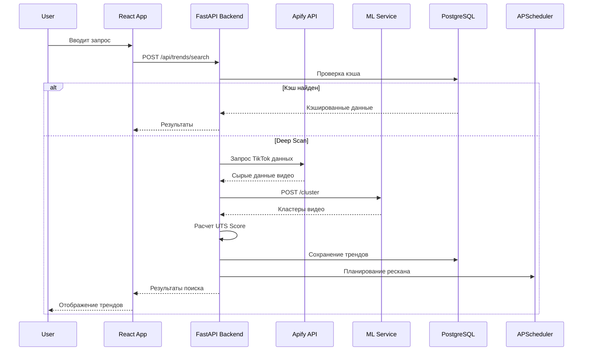
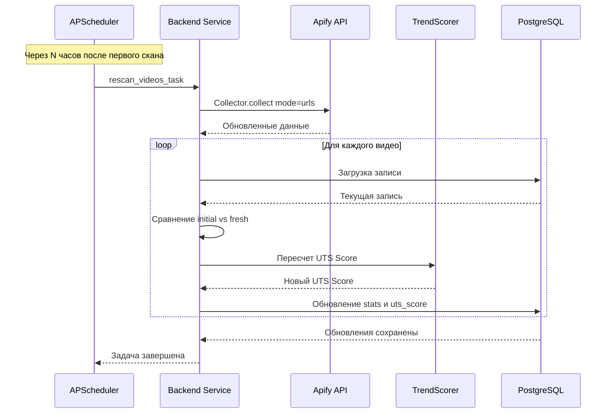
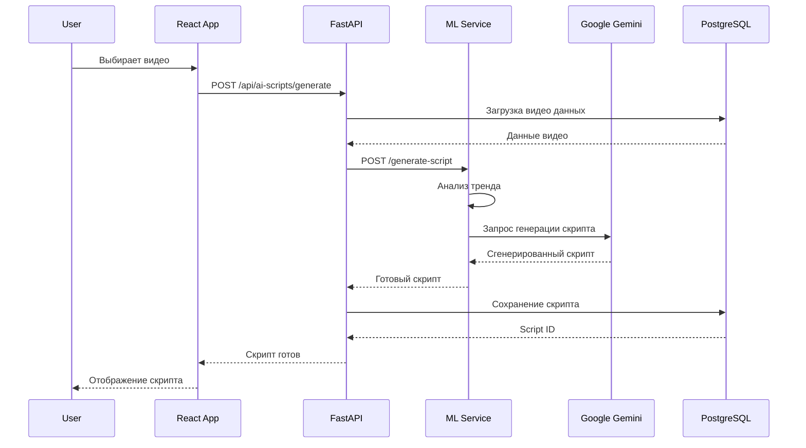
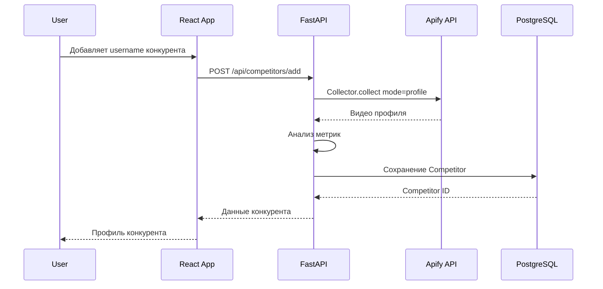
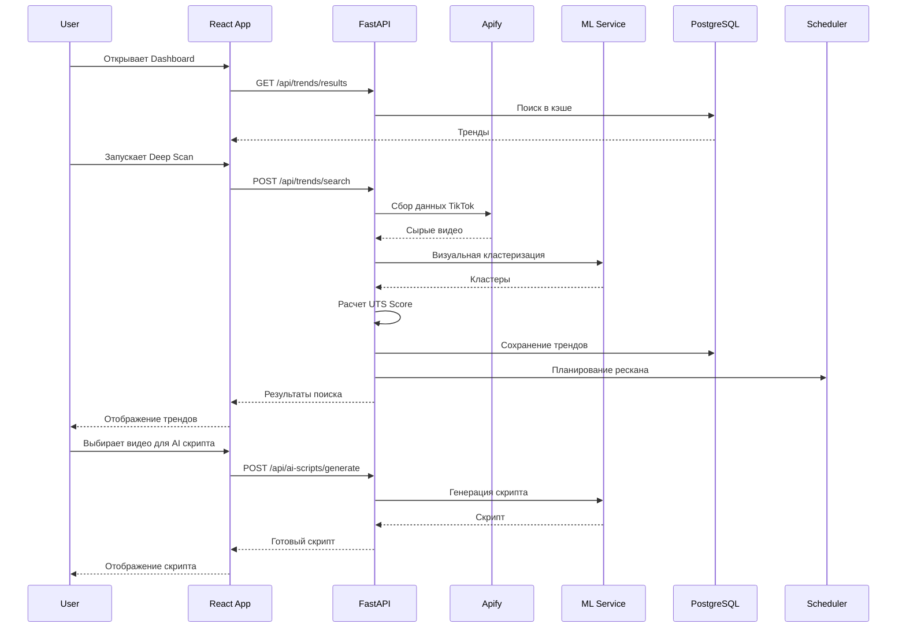
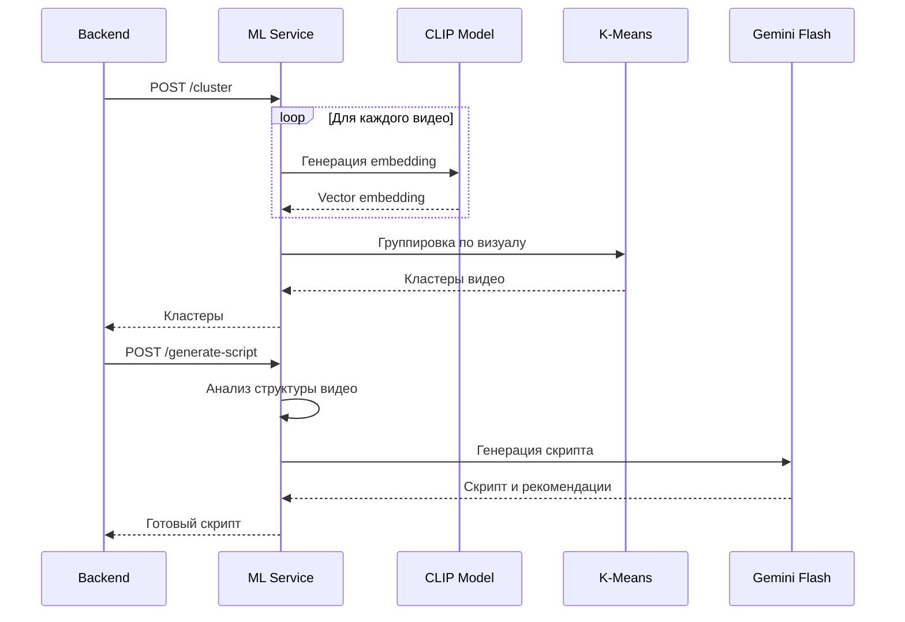
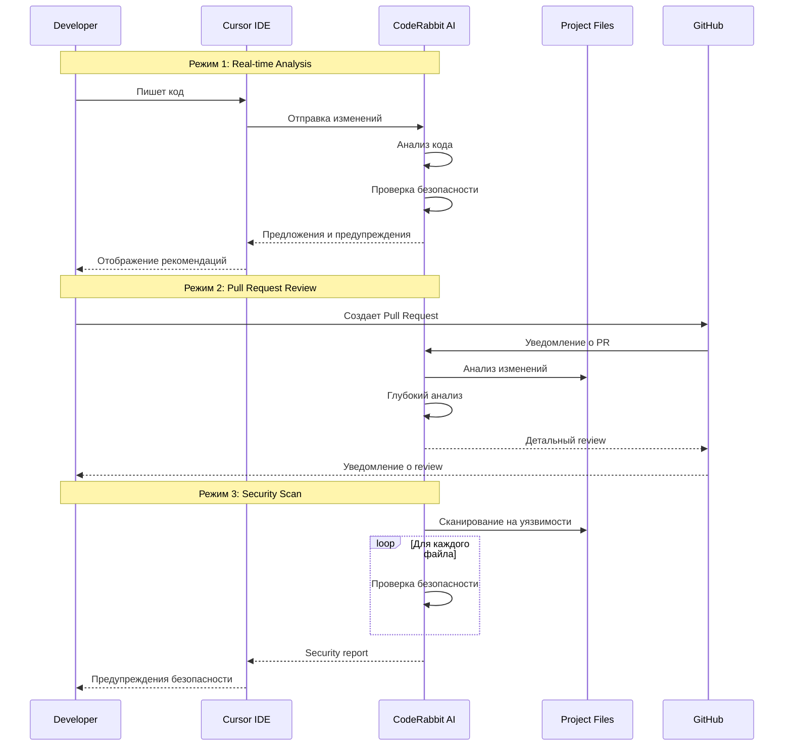
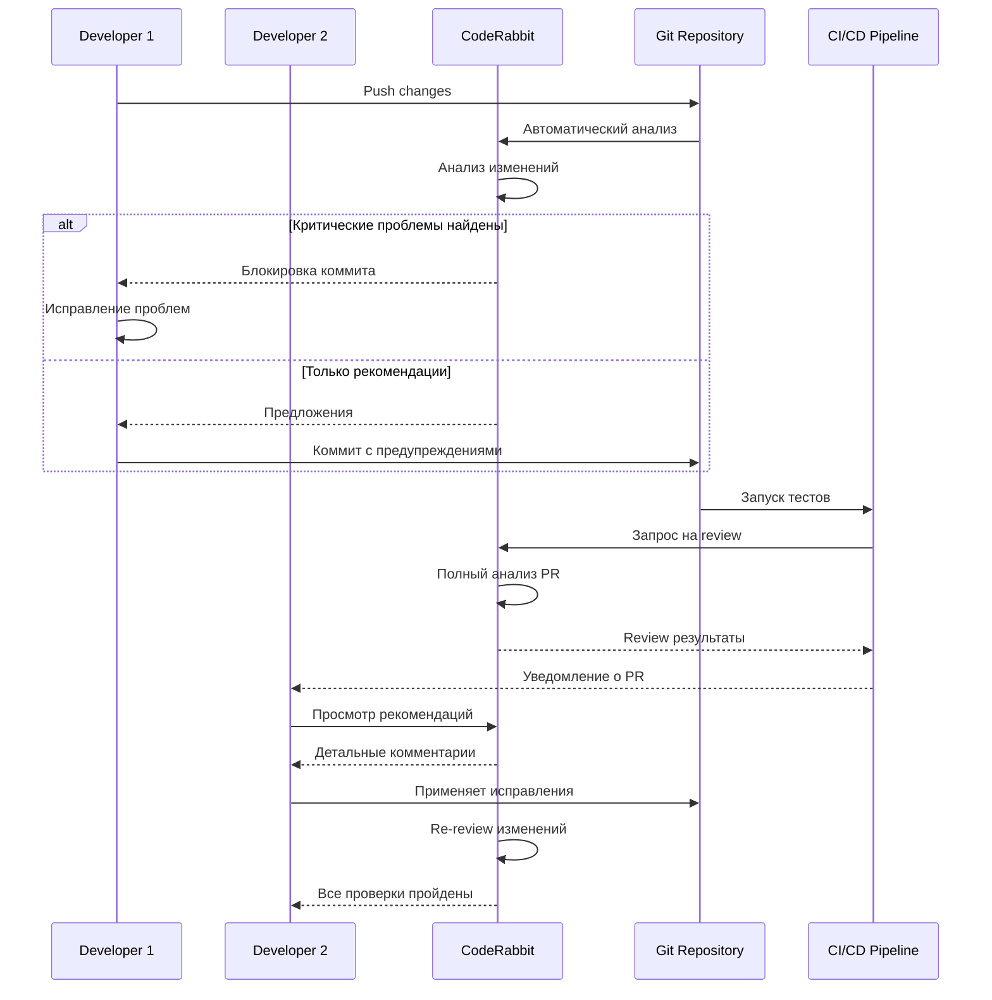
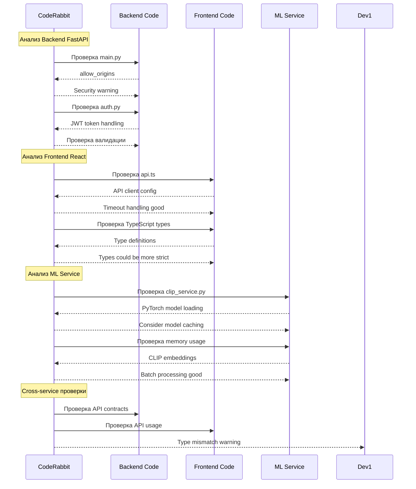

# Sequence Diagrams - TrendScout AI

## 1. Deep Scan Flow (Поиск трендов с глубоким анализом)

## 2. Auto-Rescan Flow (Автоматическая сверка роста)

## 3. AI Script Generation Flow (Генерация скриптов)

## 4. Competitor Tracking Flow (Отслеживание конкурентов)

## 5. Complete User Journey (Полный путь пользователя)

## 6. ML Service Internal Flow (Внутренний поток ML сервиса)

## 7. CodeRabbit Code Review Flow (Автоматический анализ кода)

## 8. CodeRabbit Integration with Development Workflow

## 9. CodeRabbit для TrendScout AI - Специфичные проверки

## Технологии и компоненты

- **Frontend**: React + TypeScript + Vite
- **Backend**: FastAPI + SQLAlchemy + APScheduler
- **ML Service**: PyTorch + CLIP + Google Gemini Flash
- **Database**: PostgreSQL + pgvector
- **External APIs**: Apify (TikTok scraper)
- **Code Review**: CodeRabbit AI (Real-time + PR analysis)

## Ключевые особенности

1. **Deep Scan**: 6-слойный анализ (UTS Score) + визуальная кластеризация
2. **Auto-Rescan**: Автоматическая сверка роста через планировщик
3. **AI Scripts**: Генерация TikTok скриптов на основе трендов
4. **Competitor Tracking**: Мониторинг конкурентов в реальном времени
5. **CodeRabbit Integration**: Автоматический анализ кода для безопасности и качества
